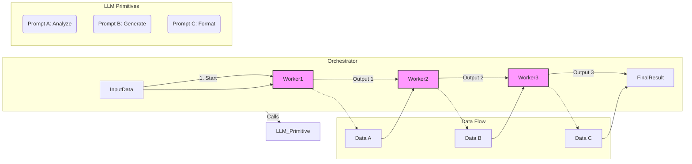

# PATTERN: The Assembly Line

> **Intent:** To process a piece of data through a series of discrete, specialized transformation stages, where each stage is performed by an LLM agent with a unique prompt and its output serves as the input for the next.

---

## 1. Context & Motivation

Many complex data processing tasks are too large or varied for a single LLM prompt to handle effectively. For example, creating a full technical document from a block of code involves several distinct cognitive steps:
1.  Analyzing the code's functionality.
2.  Identifying the core logic and potential edge cases.
3.  Generating unit tests to validate behavior.
4.  Writing user-facing documentation with examples.

Attempting to do all this with one "mega-prompt" is brittle and often produces mediocre results in all areas. A specialist will always outperform a generalist. This is analogous to a factory assembly line, where each station performs one specific task perfectly before passing the product to the next.

**The Assembly Line** pattern solves this by breaking down a complex task into a linear sequence of simpler, specialized sub-tasks. Each sub-task is assigned to a highly focused LLM "worker," each with its own tailored prompt. This approach produces higher-quality results, improves reliability, and makes the system easier to debug.

## 2. Applicability & Use Cases

This pattern is the optimal choice for any complex transformation that can be decomposed into a clear, sequential series of steps.

Use this pattern when:
-   A task has clearly distinct stages (e.g., Extract, Transform, Analyze, Summarize).
-   Different stages require fundamentally different "skills" or output formats.
-   You want to maximize the quality of each step by using a highly specialized prompt.
-   The overall process is linear and does not require complex branching or dynamic decision-making about the workflow itself.

**Examples:**
-   **Code-to-Documentation Pipeline:** `Stage 1 (Code Analyst)` extracts function signatures and logic -> `Stage 2 (Test Generator)` creates unit tests from the analysis -> `Stage 3 (Doc Writer)` writes markdown documentation using the code analysis and test cases as examples.
-   **Incoming Email Processor:** `Stage 1 (Classifier)` categorizes an email (e.g., 'Sales', 'Support', 'Spam') -> `Stage 2 (Data Extractor)` pulls out key entities like name, company, and order number -> `Stage 3 (Draft Responder)` writes a tailored draft reply based on the category and extracted data.
-   **Research Paper Summarizer:** `Stage 1 (Abstract Parser)` extracts the abstract, hypothesis, and key findings -> `Stage 2 (Methodology Summarizer)` details the research methods used -> `Stage 3 (Executive Summarizer)` combines the outputs into a one-page summary for a non-expert audience.

## 3. Structure & Participants

**Diagram:**

*(Note: This diagram is a conceptual representation. The `Orchestrator` is the code that calls each worker sequentially.)*

**Participants:**
-   **The Orchestrator:** The main script or application responsible for managing the sequence. It calls the first worker, waits for its response, then calls the second worker with that response as input, and so on.
-   **The Data Object:** The piece of data being processed. Unlike the Recursive Inquisitor's state object, this object is transient and transformed at each stage. It can be a simple string, or a JSON object that is progressively enriched.
-   **LLM Workers (The Stages):** A series of LLM calls. Each worker is defined by a unique, highly specialized **Prompt**.
    -   `Worker 1 (e.g., The Analyst)`: Has a prompt focused on deconstruction and analysis.
    -   `Worker 2 (e.g., The Synthesizer)`: Has a prompt focused on creation or transformation, using the Analyst's output.
    -   `Worker N (e.g., The Formatter)`: Has a prompt focused on presenting the final data in a specific format.

## 4. Collaboration & Dynamics

The pattern operates as a simple, sequential workflow managed by the Orchestrator.

1.  **Initialization:** The Orchestrator receives the initial input data (e.g., a file's content).
2.  **Stage 1 Execution:** The Orchestrator invokes the first LLM Worker, passing the initial data. The prompt for this worker is highly specialized for the first task (e.g., "Analyze this code and return a JSON object of its functions.").
3.  **Data Hand-off:** The Orchestrator receives the output from Worker 1. It performs validation (`PROBABILISTIC_RESILIENCE`).
4.  **Stage 2 Execution:** The Orchestrator invokes the second LLM Worker, using the *entire output* of Worker 1 as the input. The prompt for this worker is specialized for the second task (e.g., "Given this JSON analysis of functions, generate unit tests for each function.").
5.  **Sequential Progression:** The process repeats for all subsequent stages. The output of `Worker N` becomes the input for `Worker N+1`.
6.  **Termination:** After the final worker completes its task, the Orchestrator returns its output as the final result of the entire pipeline.

## 5. Consequences & Trade-offs

-   **Benefits:**
    -   `Specialization & Quality`: Each stage can be hyper-optimized for a single task, leading to significantly higher-quality outputs compared to a single monolithic prompt.
    -   `Modularity & Maintainability`: Each stage is a self-contained component. It's easy to debug, improve, or even swap out a single stage (e.g., improve the Test Generator prompt) without affecting the rest of the pipeline.
    -   `Reduced Complexity`: Each prompt is simpler and more focused, making them easier to write and less prone to instruction-following errors.

-   **Trade-offs / Risks:**
    -   `Increased Latency`: The total processing time is the sum of latencies from multiple, sequential LLM calls, which can be slow.
    -   `Error Cascading`: An error or poor-quality output from an early stage will negatively impact all subsequent stages. Robust validation between each step is critical.
    -   `Information Loss`: If not designed carefully, important context from the initial data can be lost as it's passed through stages. A common mitigation is to use an enriching JSON object that carries forward key data from previous stages, rather than just passing the direct output.

## 6. Reference Implementation

An implementation would consist of an orchestration script and multiple prompt files.

### Example Implementation

**`run_pipeline.sh` (Orchestrator):**
```bash
#!/bin/bash
# Assembly Line Pattern - Code Documentation Pipeline
INPUT_FILE="$1"
PROMPT_DIR="prompts"

# Validate input
if [ -z "$INPUT_FILE" ] || [ ! -f "$INPUT_FILE" ]; then
  echo "Usage: $0 <source_code_file>"
  exit 1
fi

# Stage 1: Analyze Code
echo "🔍 Stage 1: Analyzing code structure..."
ANALYSIS_JSON=$(cat "$INPUT_FILE" | claude -p "$(cat ${PROMPT_DIR}/01_analyze_code.txt)")
if [ $? -ne 0 ] || ! echo "$ANALYSIS_JSON" | jq . > /dev/null 2>&1; then
  echo "❌ Stage 1 failed: Invalid analysis output"
  exit 1
fi

# Stage 2: Generate Tests
echo "🧪 Stage 2: Generating test cases..."
TESTS_JSON=$(echo "$ANALYSIS_JSON" | claude -p "$(cat ${PROMPT_DIR}/02_generate_tests.txt)")
if [ $? -ne 0 ] || ! echo "$TESTS_JSON" | jq . > /dev/null 2>&1; then
  echo "❌ Stage 2 failed: Invalid test generation"
  exit 1
fi

# Stage 3: Write Documentation
echo "📝 Stage 3: Creating documentation..."
# Combine previous outputs to prevent information loss
COMBINED_INPUT=$(jq -n \
  --argjson analysis "$ANALYSIS_JSON" \
  --argjson tests "$TESTS_JSON" \
  --arg source "$(cat "$INPUT_FILE")" \
  '{
    "code_analysis": $analysis,
    "test_cases": $tests,
    "original_source": $source
  }')

FINAL_DOCS=$(echo "$COMBINED_INPUT" | claude -p "$(cat ${PROMPT_DIR}/03_write_docs.txt)")

# Output results
echo -e "\n✅ Pipeline complete! Documentation:\n"
echo "$FINAL_DOCS"
```

**Prompt Files:**

**`prompts/01_analyze_code.txt`:**
```
You are a code analysis specialist in a documentation pipeline.
Your task is to analyze the provided source code and extract structural information.

Analyze the code and identify:
- All functions/methods with their signatures
- Input parameters and return types
- Core logic and algorithms used
- Dependencies and imports

Respond ONLY with valid JSON in this format:
{
  "language": "detected language",
  "functions": [
    {
      "name": "function name",
      "signature": "full signature",
      "parameters": ["param1", "param2"],
      "returns": "return type",
      "purpose": "brief description",
      "complexity": "low|medium|high"
    }
  ],
  "imports": ["list of imports"],
  "key_algorithms": ["identified algorithms"]
}

SOURCE CODE:
```

**`prompts/02_generate_tests.txt`:**
```
You are a test generation specialist in a documentation pipeline.
Given the code analysis, generate comprehensive unit tests.

For each function in the analysis:
1. Create at least 3 test cases
2. Include edge cases and error conditions
3. Use descriptive test names

Respond ONLY with valid JSON in this format:
{
  "test_framework": "suggested framework",
  "tests": [
    {
      "function_name": "function being tested",
      "test_cases": [
        {
          "name": "test_function_with_valid_input",
          "input": "example input",
          "expected_output": "expected result",
          "test_type": "happy_path|edge_case|error_case"
        }
      ]
    }
  ]
}

CODE ANALYSIS:
```

**`prompts/03_write_docs.txt`:**
```
You are a technical documentation writer, the final stage in a documentation pipeline.
Using the code analysis, test cases, and original source, create comprehensive documentation.

Create documentation that includes:
1. Overview and purpose
2. Installation/setup instructions
3. API reference with examples
4. Code examples from the test cases
5. Best practices and common pitfalls

Format the output as clean, readable Markdown suitable for a README.md file.

COMBINED INPUT:
```

### Key Implementation Details

1. **Error Handling**: Each stage validates its output before proceeding
2. **Information Preservation**: The final stage receives all previous outputs plus the original source
3. **Clear Progress Indication**: Visual feedback shows which stage is executing
4. **Modular Prompts**: Each prompt file can be edited independently

### Advanced Usage

For more complex pipelines, consider:

```bash
# Parallel branches that merge
BRANCH_A=$(echo "$DATA" | pipeline_a.sh)
BRANCH_B=$(echo "$DATA" | pipeline_b.sh)
MERGED=$(merge_results.sh "$BRANCH_A" "$BRANCH_B")

# Dynamic stage selection
if [ "$DATA_TYPE" = "code" ]; then
  STAGES="analyze_code|generate_tests|write_docs"
else
  STAGES="parse_text|extract_entities|summarize"
fi
```

The Assembly Line pattern transforms complex tasks into manageable, high-quality outputs through specialization and sequential processing—the production line of the AI age.