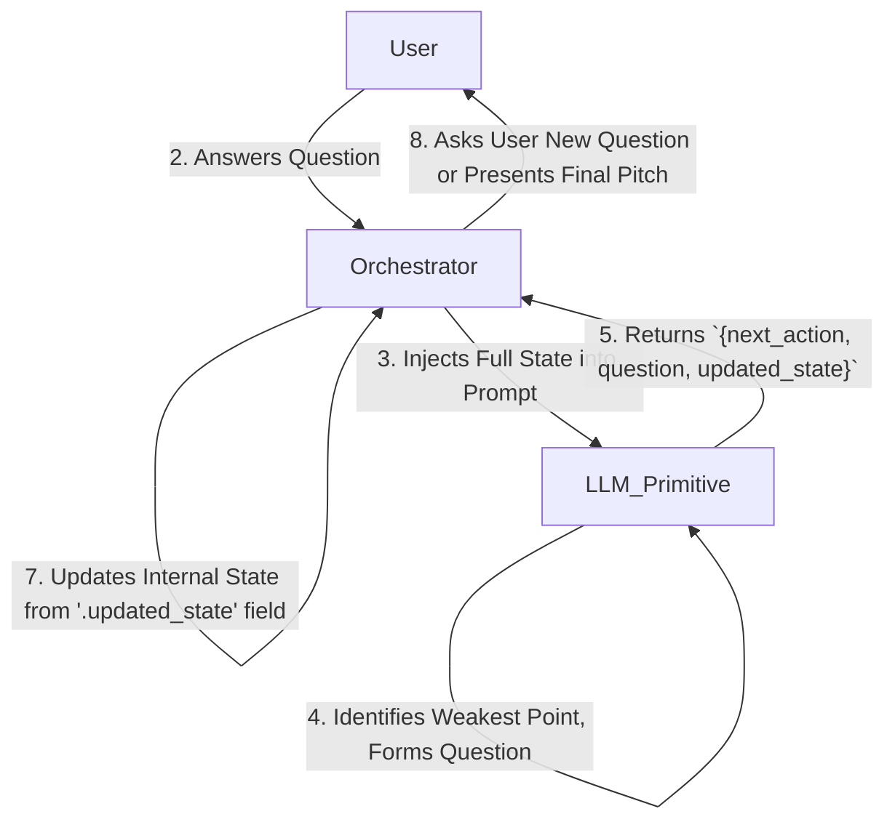

# PATTERN: The Recursive Inquisitor

> **Intent:** To iteratively refine a complex and poorly-defined problem or concept into a structured, well-defined state by having an LLM agent dynamically ask clarifying questions until a termination condition is met.

---

## 1. Context & Motivation

A common challenge in software is capturing vague initial requirements. A user might say, "I want to build an app for pet owners," but this statement is insufficient for any meaningful design work. A human consultant would engage in a dialogue, asking targeted questions to uncover the underlying problem, the target user, and key features.

A naive approach using an LLM would be to start a simple chat. However, this method is flawed:
*   The LLM lacks a clear objective and may wander aimlessly.
*   The "state" of the refined idea is scattered throughout a conversational history, making it difficult to maintain a coherent vision.
*   The LLM has no mechanism to know when the idea is "complete" and the dialogue should end.

**The Recursive Inquisitor** pattern solves this by framing the interaction not as a conversation, but as a stateful, goal-oriented process. The LLM's objective is to "fill out a form" (the State Object). Its primary skill is determining the most important empty field on that form and formulating the perfect question to get the user's help in filling it.

## 2. Applicability & Use Cases

This pattern is the ideal solution when an interactive process is required to build up a complex data model from ambiguous initial input.

Use this pattern when:
-   A task requires moving from a high-level, unstructured idea to a detailed, structured plan.
-   The "path" of inquiry is not linear and must be determined dynamically at each step.
-   The system needs to maintain a coherent, holistic view of a subject while drilling down into specific details.
-   The process must have a clear, AI-driven termination condition.

**Examples:**
-   **Startup Idea Consultant:** Taking a one-sentence idea and developing it into a mini-business plan (the reference implementation).
-   **AI-Powered Debugger:** Starting with an error message ("database connection failed") and recursively asking for more information (log files, config files, network status) until a root cause is identified.
-   **Medical Triage Bot:** Taking an initial symptom from a patient and asking a series of targeted questions to assess urgency and recommend a next step (e.g., "See a doctor," "Rest at home").
-   **Custom Travel Itinerary Planner:** Guiding a user from "I want to go to Italy for a week" to a fully detailed day-by-day travel plan.

## 3. Structure & Participants

**Diagram:**


**Participants:**
-   **The Orchestrator:** The `idea_consultant.sh` script. It runs the main loop, manages user I/O, and makes the API calls.
-   **The State Object:** The core JSON object containing `user_response_for_this_turn`, `idea_canvas`, and `consultant_analysis_log`. It represents the complete memory of the refinement process.
-   **The LLM Primitive:** The Claude model. Its role is to execute the instructions in the `PROMPT`.
-   **The Prompt:** A detailed prompt instructing the LLM to act as a consultant, analyze the `idea_canvas` for weaknesses, and return a structured JSON object with the next action and updated state.
-   **The User:** The person providing the initial idea and answering the LLM's questions.

## 4. Collaboration & Dynamics

The pattern functions as a state machine managed by the Orchestrator, with the state transitions guided by the LLM.

1.  **Initialization:** The User provides a seed idea. The Orchestrator creates the initial State Object, placing the seed idea into the `user_response_for_this_turn` field.
2.  **Input Loop (starts):**
3.  **Prompt Assembly:** The Orchestrator injects the entire current State Object into the master Prompt.
4.  **LLM Invocation:** The Orchestrator sends the prompt to the LLM.
5.  **Response & Validation:** The Orchestrator receives the JSON response. It validates that the JSON is well-formed and contains a valid `next_action`. This is a critical `PROBABILISTIC_RESILIENCE` checkpoint.
6.  **State Transition & Update:** The Orchestrator reads the `updated_state` field from the LLM's response. This field becomes the *new, complete* State Object for the next iteration. This step is crucial; the system trusts the LLM's view of the newly integrated state.
7.  **Action Execution:** The Orchestrator inspects the `next_action` field:
    -   If `"ask"`, it extracts the `question_for_user` and presents it. It then waits for user input, looping back to Step 2.
    -   If `"conclude"`, it extracts the `refined_pitch`, presents the final result to the user, and terminates the loop.

## 5. Consequences & Trade-offs

-   **Benefits:**
    -   `Dynamic Focus:` The system automatically "zooms in" on the most important unresolved issues, resulting in a highly efficient refinement process.
    -   `High Coherence:` By re-evaluating the entire `idea_canvas` at each step, the LLM maintains a holistic and consistent vision, preventing contradictory elements.
    -   `User-Centric:` It feels like a natural, intelligent dialogue to the user, hiding the complex state management happening in the background.
    -   `Explainability:` The `consultant_analysis_log` and `question_reasoning` fields provide a built-in audit trail of the AI's "thought process."

-   **Trade-offs / Risks:**
    -   `Context Window Bottleneck:` This is the primary risk. For extremely complex or lengthy refinements, the JSON state object could grow to exceed the model's context window. Mitigation strategies could include summarizing older, "refined" fields.
    -   `Potential for Loops:` A poorly designed prompt could cause the LLM to get stuck, asking similar questions repeatedly. The Orchestrator should include an iteration limit (as the script does) as a failsafe.
    -   `Prompt Brittleness:` The system's performance is highly dependent on the quality of the master prompt. Small changes to the prompt can have a large impact on behavior, requiring careful testing.

## 6. Reference Implementation

The `idea_consultant.sh` script and its accompanying prompt serves as the official reference implementation for this pattern. The key components are:

-   **`run.sh`:** The `idea_consultant.sh` script containing the `while` loop, user I/O handling, and `claude` command invocation.
-   **`prompt.txt`:** The multi-line string variable `PROMPT` within the script.
-   **State Object:** The JSON structure created and managed by the script, with its core `idea_canvas` component.
-   **Response Object:** The expected JSON output from Claude, containing `next_action` and `updated_state`.

### Example Implementation

```bash
#!/bin/bash
# idea_consultant.sh - Reference implementation of the Recursive Inquisitor pattern

# Initialize state template
STATE_TEMPLATE='{
  "user_response_for_this_turn": null,
  "idea_canvas": {
    "problem": {"value": null, "status": "empty"},
    "solution": {"value": null, "status": "empty"},
    "target_audience": {"value": null, "status": "empty"},
    "unique_value": {"value": null, "status": "empty"}
  },
  "consultant_analysis_log": []
}'

# Master prompt
PROMPT='You are an expert startup consultant using the Recursive Inquisitor pattern.

Your goal: Transform vague ideas into well-structured business concepts by asking targeted questions.

Given the current state JSON, you must:
1. Analyze the idea_canvas to find the weakest/most important missing element
2. Formulate a single, focused question to address that gap
3. Return a JSON response with your next action

Response format:
{
  "next_action": "ask" | "conclude",
  "question_for_user": {
    "question_text": "Your focused question here",
    "question_reasoning": "Why this question matters now"
  },
  "updated_state": { ...complete updated state object... },
  "refined_pitch": { ...only if next_action is "conclude"... }
}'

# Get initial idea
echo "What's your startup idea?"
read -r SEED_IDEA

# Initialize state
STATE=$(echo "$STATE_TEMPLATE" | jq ".user_response_for_this_turn = \"$SEED_IDEA\"")

# Main refinement loop
ITERATION=0
MAX_ITERATIONS=10

while [ $ITERATION -lt $MAX_ITERATIONS ]; do
  ((ITERATION++))
  
  # Call LLM with current state
  RESPONSE=$(echo "$STATE" | claude -p "$PROMPT")
  
  # Validate response
  if ! echo "$RESPONSE" | jq -e '.next_action' > /dev/null; then
    echo "Error: Invalid response from LLM"
    exit 1
  fi
  
  # Extract action
  ACTION=$(echo "$RESPONSE" | jq -r '.next_action')
  
  if [ "$ACTION" = "ask" ]; then
    # Extract and ask question
    QUESTION=$(echo "$RESPONSE" | jq -r '.question_for_user.question_text')
    echo -e "\n🤔 $QUESTION"
    read -r USER_ANSWER
    
    # Update state for next iteration
    STATE=$(echo "$RESPONSE" | jq ".updated_state.user_response_for_this_turn = \"$USER_ANSWER\" | .updated_state")
    
  elif [ "$ACTION" = "conclude" ]; then
    # Present final result
    echo -e "\n✅ Refinement complete!"
    echo "$RESPONSE" | jq -r '.refined_pitch'
    exit 0
  fi
done

echo "Maximum iterations reached"
```

### Key Implementation Details

1. **State Persistence**: The state is maintained as a JSON object throughout the interaction
2. **Validation**: Each LLM response is validated before processing
3. **Clear Termination**: The loop has both AI-driven (`conclude`) and safety (`MAX_ITERATIONS`) termination conditions
4. **User Experience**: Questions are presented clearly with visual indicators

This pattern transforms vague inputs into structured outputs through intelligent, dynamic questioning—a powerful tool for any system that needs to extract clarity from ambiguity.