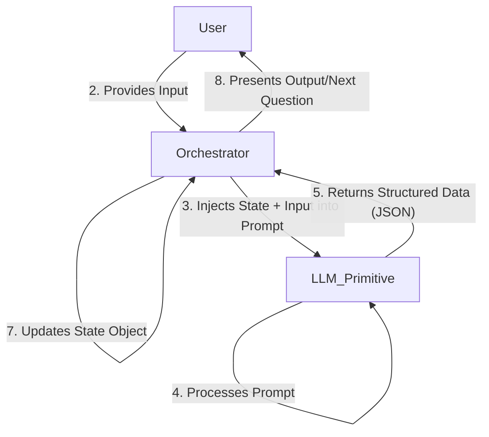
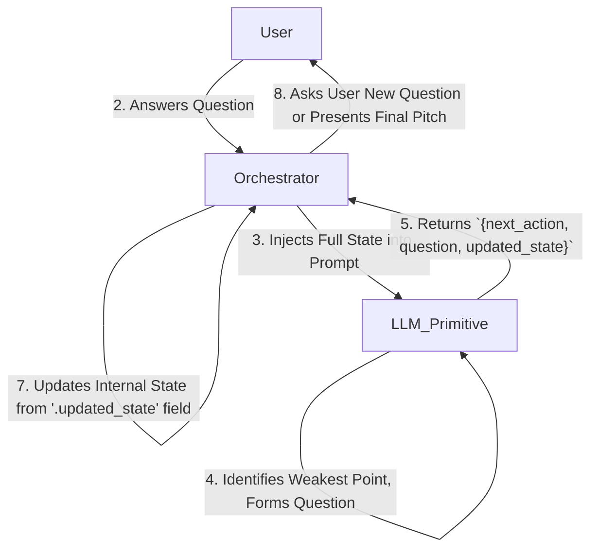

# Phase Two

### **The Official Promethean Pattern Template**

```markdown
# PATTERN: [Pattern Name]

> **Intent:** [A one-sentence, "elevator pitch" description of the pattern's purpose.]

---

## 1. Context & Motivation

*What specific, recurring problem does this pattern solve in LLM orchestration?*

This section describes a "problem-story." It outlines a scenario where a naive approach would fail or be inefficient. For example, "When attempting to refine a complex idea over multiple turns, simply appending to a chat history results in a loss of focus and requires the LLM to re-parse the entire conversation history, which is inefficient and error-prone."

## 2. Applicability & Use Cases

*Under what specific circumstances is this pattern the correct solution?*

This section provides a checklist of conditions and concrete examples.
Use this pattern when:
- You need to manage state across multiple LLM calls.
- The interaction is goal-oriented rather than conversational.
- The system must iteratively build upon or refine a complex data object.

**Examples:**
- Interactive idea refinement and business planning.
- A multi-step root cause analysis agent.
- A configuration wizard that guides a user through complex setup.

## 3. Structure & Participants

*What are the components of this pattern and how are they arranged?*

This section includes a visual diagram and a breakdown of the key players.

**Diagram:**


**Participants:**
- **The Orchestrator:** The primary code harness (e.g., a shell script, a Python application). It holds the state, calls the LLM, and executes the core program logic.
- **The State Object:** A single, structured data object (e.g., JSON) that represents the entire "memory" of the task. It is the sole source of truth.
- **The LLM Primitive:** The Language Model, accessed via its API. Its only role is to execute the function defined in the prompt.
- **The Prompt:** A carefully crafted set of instructions that tells the LLM how to process the State Object and produce a new structured output.
- **The User (Optional):** The human providing interactive input. In fully automated systems, this participant may be another system or data source.

## 4. Collaboration & Dynamics

*How do the participants interact step-by-step to achieve the pattern's goal?*

This section describes the "collaboration sequence" or the flow of control, referencing the diagram.

1.  **Initialization:** The Orchestrator creates an initial State Object.
2.  **Input Loop (starts):** The Orchestrator takes input (from a User or other source).
3.  **Prompt Assembly:** The Orchestrator injects the *entire* current State Object and the new input into the Prompt template.
4.  **LLM Invocation:** The Orchestrator sends the fully assembled prompt to the LLM Primitive.
5.  **Response & Validation:** The Orchestrator receives the structured data response. It immediately validates the syntax (e.g., is it valid JSON?) and semantics (e.g., does it contain the expected fields?). This is a critical `PROBABILISTIC_RESILIENCE` checkpoint.
6.  **State Update:** The Orchestrator parses the response and updates its internal State Object with the new information.
7.  **Loop/Conclude:** Based on the data returned by the LLM (e.g., a `next_action` field), the Orchestrator decides whether to loop back to Step 2 or to terminate and present a final result.

## 5. Consequences & Trade-offs

*What are the benefits and drawbacks of using this pattern?*

- **Benefits:**
  - `High State Fidelity`: Ensures the LLM always operates on the most complete and up-to-date context.
  - `Robustness`: Decouples program logic from the LLM, making the system more testable and less prone to hallucinated control flow.
  - `Focus`: By identifying and targeting specific parts of the state object, the LLM's task is simplified, leading to higher-quality outputs.

- **Trade-offs / Risks:**
  - `Context Window Limitation`: The entire state is passed on every call. For very long interactions, the serialized state object can exceed the LLM's context window.
  - `Cost & Latency`: Sending a large state object on every turn increases token usage and can increase latency.
  - `Schema Rigidity`: The pattern relies heavily on a well-defined state schema. Changes to the schema may require significant updates to the prompt and orchestration logic.

## 6. Reference Implementation

*Show me the code.*

This section contains a clean, minimal, well-commented "hello world" example of the pattern in action. It will include:
- **`run.sh`:** A simple bash orchestrator.
- **`prompt.txt`:** The master prompt.
- **`state.json` (example):** An example of the state object mid-process.
- **`claude_response.json` (example):** An example of what the LLM's output looks like.

---

# **PATTERN: The Recursive Inquisitor**

> **Intent:** To iteratively refine a complex and poorly-defined problem or concept into a structured, well-defined state by having an LLM agent dynamically ask clarifying questions until a termination condition is met.

---

## 1. Context & Motivation

A common challenge in software is capturing vague initial requirements. A user might say, "I want to build an app for pet owners," but this statement is insufficient for any meaningful design work. A human consultant would engage in a dialogue, asking targeted questions to uncover the underlying problem, the target user, and key features.

A naive approach using an LLM would be to start a simple chat. However, this method is flawed:
*   The LLM lacks a clear objective and may wander aimlessly.
*   The "state" of the refined idea is scattered throughout a conversational history, making it difficult to maintain a coherent vision.
*   The LLM has no mechanism to know when the idea is "complete" and the dialogue should end.

**The Recursive Inquisitor** pattern solves this by framing the interaction not as a conversation, but as a stateful, goal-oriented process. The LLM's objective is to "fill out a form" (the State Object). Its primary skill is determining the most important empty field on that form and formulating the perfect question to get the user's help in filling it.

## 2. Applicability & Use Cases

This pattern is the ideal solution when an interactive process is required to build up a complex data model from ambiguous initial input.

Use this pattern when:
-   A task requires moving from a high-level, unstructured idea to a detailed, structured plan.
-   The "path" of inquiry is not linear and must be determined dynamically at each step.
-   The system needs to maintain a coherent, holistic view of a subject while drilling down into specific details.
-   The process must have a clear, AI-driven termination condition.

**Examples:**
-   **Startup Idea Consultant:** Taking a one-sentence idea and developing it into a mini-business plan (our reference implementation).
-   **AI-Powered Debugger:** Starting with an error message ("database connection failed") and recursively asking for more information (log files, config files, network status) until a root cause is identified.
-   **Medical Triage Bot:** Taking an initial symptom from a patient and asking a series of targeted questions to assess urgency and recommend a next step (e.g., "See a doctor," "Rest at home").
-   **Custom Travel Itinerary Planner:** Guiding a user from "I want to go to Italy for a week" to a fully detailed day-by-day travel plan.

## 3. Structure & Participants

**Diagram:**


**Participants:**
-   **The Orchestrator:** The `idea_consultant.sh` script. It runs the main loop, manages user I/O, and makes the API calls.
-   **The State Object:** The core JSON object containing `user_response_for_this_turn`, `idea_canvas`, and `consultant_analysis_log`. It represents the complete memory of the refinement process.
-   **The LLM Primitive:** The Claude model. Its role is to execute the instructions in the `PROMPT`.
-   **The Prompt:** A detailed prompt instructing the LLM to act as a consultant, analyze the `idea_canvas` for weaknesses, and return a structured JSON object with the next action and updated state.
-   **The User:** The person providing the initial idea and answering the LLM's questions.

## 4. Collaboration & Dynamics

The pattern functions as a state machine managed by the Orchestrator, with the state transitions guided by the LLM.

1.  **Initialization:** The User provides a seed idea. The Orchestrator creates the initial State Object, placing the seed idea into the `user_response_for_this_turn` field.
2.  **Input Loop (starts):**
3.  **Prompt Assembly:** The Orchestrator injects the entire current State Object into the master Prompt.
4.  **LLM Invocation:** The Orchestrator sends the prompt to the LLM.
5.  **Response & Validation:** The Orchestrator receives the JSON response. It validates that the JSON is well-formed and contains a valid `next_action`. This is a critical `PROBABILISTIC_RESILIENCE` checkpoint.
6.  **State Transition & Update:** The Orchestrator reads the `updated_state` field from the LLM's response. This field becomes the *new, complete* State Object for the next iteration. This step is crucial; we trust the LLM's view of the newly integrated state.
7.  **Action Execution:** The Orchestrator inspects the `next_action` field:
    -   If `"ask"`, it extracts the `question_for_user` and presents it. It then waits for user input, looping back to Step 2.
    -   If `"conclude"`, it extracts the `refined_pitch`, presents the final result to the user, and terminates the loop.

## 5. Consequences & Trade-offs

-   **Benefits:**
    -   `Dynamic Focus:` The system automatically "zooms in" on the most important unresolved issues, resulting in a highly efficient refinement process.
    -   `High Coherence:` By re-evaluating the entire `idea_canvas` at each step, the LLM maintains a holistic and consistent vision, preventing contradictory elements.
    -   `User-Centric:` It feels like a natural, intelligent dialogue to the user, hiding the complex state management happening in the background.
    -   `Explainability:` The `consultant_analysis_log` and `question_reasoning` fields provide a built-in audit trail of the AI's "thought process."

-   **Trade-offs / Risks:**
    -   `Context Window Bottleneck:` This is the primary risk. For extremely complex or lengthy refinements, the JSON state object could grow to exceed the model's context window. Mitigation strategies could include summarizing older, "refined" fields.
    -   `Potential for Loops:` A poorly designed prompt could cause the LLM to get stuck, asking similar questions repeatedly. The Orchestrator should include an iteration limit (as our script does) as a failsafe.
    -   `Prompt Brittleness:` The system's performance is highly dependent on the quality of the master prompt. Small changes to the prompt can have a large impact on behavior, requiring careful testing.

## 6. Reference Implementation

The `idea_consultant.sh` script and its accompanying prompt that we developed serves as the official reference implementation for this pattern. The key components are:

-   **`run.sh`:** The `idea_consultant.sh` script containing the `while` loop, user I/O handling, and `claude` command invocation.
-   **`prompt.txt`:** The multi-line string variable `PROMPT` within the script.
-   **State Object:** The JSON structure created and managed by the script, with its core `idea_canvas` component.
-   **Response Object:** The expected JSON output from Claude, containing `next_action` and `updated_state`.

---
---

# **PATTERN: The Assembly Line**

> **Intent:** To process a piece of data through a series of discrete, specialized transformation stages, where each stage is performed by an LLM agent with a unique prompt and its output serves as the input for the next.

---

## 1. Context & Motivation

Many complex data processing tasks are too large or varied for a single LLM prompt to handle effectively. For example, creating a full technical document from a block of code involves several distinct cognitive steps:
1.  Analyzing the code's functionality.
2.  Identifying the core logic and potential edge cases.
3.  Generating unit tests to validate behavior.
4.  Writing user-facing documentation with examples.

Attempting to do all this with one "mega-prompt" is brittle and often produces mediocre results in all areas. A specialist will always outperform a generalist. This is analogous to a factory assembly line, where each station performs one specific task perfectly before passing the product to the next.

**The Assembly Line** pattern solves this by breaking down a complex task into a linear sequence of simpler, specialized sub-tasks. Each sub-task is assigned to a highly focused LLM "worker," each with its own tailored prompt. This approach produces higher-quality results, improves reliability, and makes the system easier to debug.

## 2. Applicability & Use Cases

This pattern is the optimal choice for any complex transformation that can be decomposed into a clear, sequential series of steps.

Use this pattern when:
-   A task has clearly distinct stages (e.g., Extract, Transform, Analyze, Summarize).
-   Different stages require fundamentally different "skills" or output formats.
-   You want to maximize the quality of each step by using a highly specialized prompt.
-   The overall process is linear and does not require complex branching or dynamic decision-making about the workflow itself.

**Examples:**
-   **Code-to-Documentation Pipeline:** `Stage 1 (Code Analyst)` extracts function signatures and logic -> `Stage 2 (Test Generator)` creates unit tests from the analysis -> `Stage 3 (Doc Writer)` writes markdown documentation using the code analysis and test cases as examples.
-   **Incoming Email Processor:** `Stage 1 (Classifier)` categorizes an email (e.g., 'Sales', 'Support', 'Spam') -> `Stage 2 (Data Extractor)` pulls out key entities like name, company, and order number -> `Stage 3 (Draft Responder)` writes a tailored draft reply based on the category and extracted data.
-   **Research Paper Summarizer:** `Stage 1 (Abstract Parser)` extracts the abstract, hypothesis, and key findings -> `Stage 2 (Methodology Summarizer)` details the research methods used -> `Stage 3 (Executive Summarizer)` combines the outputs into a one-page summary for a non-expert audience.

## 3. Structure & Participants

**Diagram:**
```mermaid
graph LR
    subgraph Orchestrator
        direction LR
        InputData -- "1. Start" --> Worker1
        Worker1 -- "Output 1" --> Worker2
        Worker2 -- "Output 2" --> Worker3
        Worker3 -- "Output 3" --> FinalResult
    end
    
    subgraph LLM Primitives
        direction C
        Worker1_Prompt(Prompt A: Analyze)
        Worker2_Prompt(Prompt B: Generate)
        Worker3_Prompt(Prompt C: Format)
    end
    
    Orchestrator -- Calls --> LLM_Primitive
    
    subgraph Data Flow
        direction C
        InputData --> Worker1
        W1_Out[Data A] --> Worker2
        W2_Out[Data B] --> Worker3
        W3_Out[Data C] --> FinalResult
    end
    
    Worker1 -.-> W1_Out
    Worker2 -.-> W2_Out
    Worker3 -.-> W3_Out

    classDef worker fill:#f9f,stroke:#333,stroke-width:2px;
    class Worker1,Worker2,Worker3 worker;
```
*(Note: This diagram is a conceptual representation. The `Orchestrator` is the code that calls each worker sequentially.)*

**Participants:**
-   **The Orchestrator:** The main script or application responsible for managing the sequence. It calls the first worker, waits for its response, then calls the second worker with that response as input, and so on.
-   **The Data Object:** The piece of data being processed. Unlike the Recursive Inquisitor's state object, this object is transient and transformed at each stage. It can be a simple string, or a JSON object that is progressively enriched.
-   **LLM Workers (The Stages):** A series of LLM calls. Each worker is defined by a unique, highly specialized **Prompt**.
    -   `Worker 1 (e.g., The Analyst)`: Has a prompt focused on deconstruction and analysis.
    -   `Worker 2 (e.g., The Synthesizer)`: Has a prompt focused on creation or transformation, using the Analyst's output.
    -   `Worker N (e.g., The Formatter)`: Has a prompt focused on presenting the final data in a specific format.

## 4. Collaboration & Dynamics

The pattern operates as a simple, sequential workflow managed by the Orchestrator.

1.  **Initialization:** The Orchestrator receives the initial input data (e.g., a file's content).
2.  **Stage 1 Execution:** The Orchestrator invokes the first LLM Worker, passing the initial data. The prompt for this worker is highly specialized for the first task (e.g., "Analyze this code and return a JSON object of its functions.").
3.  **Data Hand-off:** The Orchestrator receives the output from Worker 1. It performs validation (`PROBABILISTIC_RESILIENCE`).
4.  **Stage 2 Execution:** The Orchestrator invokes the second LLM Worker, using the *entire output* of Worker 1 as the input. The prompt for this worker is specialized for the second task (e.g., "Given this JSON analysis of functions, generate unit tests for each function.").
5.  **Sequential Progression:** The process repeats for all subsequent stages. The output of `Worker N` becomes the input for `Worker N+1`.
6.  **Termination:** After the final worker completes its task, the Orchestrator returns its output as the final result of the entire pipeline.

## 5. Consequences & Trade-offs

-   **Benefits:**
    -   `Specialization & Quality`: Each stage can be hyper-optimized for a single task, leading to significantly higher-quality outputs compared to a single monolithic prompt.
    -   `Modularity & Maintainability`: Each stage is a self-contained component. It's easy to debug, improve, or even swap out a single stage (e.g., improve the Test Generator prompt) without affecting the rest of the pipeline.
    -   `Reduced Complexity`: Each prompt is simpler and more focused, making them easier to write and less prone to instruction-following errors.

-   **Trade-offs / Risks:**
    -   `Increased Latency`: The total processing time is the sum of latencies from multiple, sequential LLM calls, which can be slow.
    -   `Error Cascading`: An error or poor-quality output from an early stage will negatively impact all subsequent stages. Robust validation between each step is critical.
    -   `Information Loss`: If not designed carefully, important context from the initial data can be lost as it's passed through stages. A common mitigation is to use an enriching JSON object that carries forward key data from previous stages, rather than just passing the direct output.

## 6. Reference Implementation

An implementation would consist of an orchestration script and multiple prompt files.

**`run_pipeline.sh` (Orchestrator):**
```bash
#!/bin/bash
INPUT_FILE="source_code.py"
PROMPT_DIR="prompts"

# Stage 1: Analyze Code
echo "Running Stage 1: Analysis..."
ANALYSIS_JSON=$(cat "$INPUT_FILE" | claude -p "$(cat ${PROMPT_DIR}/01_analyze_code.txt)")
if [ $? -ne 0 ]; then echo "Stage 1 failed"; exit 1; fi

# Stage 2: Generate Tests
echo "Running Stage 2: Test Generation..."
TESTS_JSON=$(echo "$ANALYSIS_JSON" | claude -p "$(cat ${PROMPT_DIR}/02_generate_tests.txt)")
if [ $? -ne 0 ]; then echo "Stage 2 failed"; exit 1; fi

# Stage 3: Write Documentation
echo "Running Stage 3: Documentation..."
# Note: Stage 3's prompt will be designed to accept a combined JSON input
COMBINED_INPUT=$(jq -n --argjson analysis "$ANALYSIS_JSON" --argjson tests "$TESTS_JSON" \
  '{ "code_analysis": $analysis, "test_cases": $tests }')
  
FINAL_DOCS=$(echo "$COMBINED_INPUT" | claude -p "$(cat ${PROMPT_DIR}/03_write_docs.txt)")

echo "Pipeline complete. Documentation:"
echo "$FINAL_DOCS"
```

**Prompt Files:**
-   `prompts/01_analyze_code.txt`: A prompt focused solely on code analysis, outputting JSON.
-   `prompts/02_generate_tests.txt`: A prompt that takes the analysis JSON and outputs JSON with test code.
-   `prompts/03_write_docs.txt`: A prompt that takes a combined JSON of analysis and tests, and outputs final Markdown.

---
---

These two patterns form the X and Y axes of a coordinate plane for LLM orchestration. Many more complex patterns will be a hybrid of these two.

What happens when the path isn't linear? This leads us to a pattern for **dynamic dispatch**, where an LLM agent acts as a switchboard, deciding *which* specialized worker to call next.

With the foundational patterns for interactive state-building (`Recursive Inquisitor`) and linear processing (`Assembly Line`) established, we now address the need for dynamic control flow. We will document our third pattern, which introduces decision-making into the orchestration process itself.

Here is the formal draft for **The Router**.

---
---

# **PATTERN: The Router**

> **Intent:** To dynamically delegate a task to one of several specialized sub-agents based on an initial analysis of the input, acting as an intelligent, context-aware switchboard.

---

## 1. Context & Motivation

Complex systems often handle a variety of tasks that cannot be processed by a single, linear pipeline. For example, a system monitoring incoming customer support tickets must handle diverse requests: one ticket might be a simple password reset, another a critical bug report, and a third a sales inquiry.

A naive approach would be to create a monolithic "do-everything" prompt, but this violates the principle of specialization and leads to poor performance. An `Assembly Line` is unsuitable because the processing path for a password reset is completely different from that of a bug report.

**The Router** pattern solves this by introducing a "triage" step. A dedicated, lightweight "Router" LLM agent first examines the input and does *nothing but classify it*. Based on its classification, the Orchestrator then dispatches the task to a completely separate, specialized `Assembly Line` or `Inquisitor` process. This is the programmatic equivalent of a call center operator asking, "Is this about sales, support, or billing?" and routing you to the correct department.

## 2. Applicability & Use Cases

This pattern is essential for any system that must handle a variety of inputs or tasks whose processing paths are not uniform.

Use this pattern when:
-   Your system has multiple, distinct "entry points" or task types.
-   The type of an incoming task is not known in advance and must be determined from the content of the input itself.
-   You want to direct tasks to highly specialized workers or sub-pipelines for maximum efficiency and quality.
-   You need to separate the logic of "classification" from the logic of "execution."

**Examples:**
-   **Intelligent Log Processor:** The `Router` reads a log line. If it sees "ERROR," it routes to the `Root Cause Analysis Inquisitor`. If "WARN," it routes to the `Trend Analysis Pipeline`. If "INFO," it sends it to a simple log archiver.
-   **Multi-purpose Chatbot Command Parser:** The `Router` reads a user's message. If it detects an intent to "book a flight," it dispatches to the `Flight Booking Assembly Line`. If the intent is "check my flight status," it dispatches to a simple `API Fetcher` agent.
-   **Dynamic Document Processing:** The `Router` inspects a document. If it's a legal contract, it routes to a `Clause Extraction Pipeline`. If it's a financial report, it routes to a `Key Figure Summarizer`. If it's a resume, it routes to a `Skills Parser`.

## 3. Structure & Participants

**Diagram:**
```mermaid
graph TD
    subgraph Orchestrator
        InputData -- "1. Receive Input" --> RouterAgent[Router LLM];
        RouterAgent -- "2. Returns `{route_decision: 'Path_A', payload: ...}`" --> DecisionGate{Decision Logic};
        DecisionGate -- "If Path A" --> Worker_A[Worker/Pipeline A];
        DecisionGate -- "If Path B" --> Worker_B[Worker/Pipeline B];
        DecisionGate -- "If Fallback" --> Fallback[Fallback Handler];
        Worker_A -- "Result A" --> FinalResult;
        Worker_B -- "Result B" --> FinalResult;
        Fallback -- "Error/Info" --> FinalResult;
    end
    
    LLM_Primitive
    Orchestrator -- "Calls LLM for agents" --> LLM_Primitive

    classDef router fill:#c9f,stroke:#333,stroke-width:2px;
    class RouterAgent router;
    classDef worker fill:#f9f,stroke:#333,stroke-width:2px;
    class Worker_A, Worker_B, Fallback worker;
```

**Participants:**
-   **The Orchestrator:** The main script or application. Its key role here is to implement the `switch` statement or `if/elif/else` logic that acts on the Router's decision.
-   **The Router Agent:** The first LLM call in the sequence. This is a lightweight, fast, and highly focused agent. Its sole purpose is to analyze the input and output a decision object, typically containing a `route` key and the original or slightly modified `payload`. Its prompt is optimized for classification and nothing else.
-   **The Specialized Workers / Pipelines:** These are the destinations for the routing. Each worker is a separate LLM agent, or even a full `Assembly Line` or `Recursive Inquisitor` pattern, with its own specialized prompt and logic.
-   **The Fallback Handler (Optional but Recommended):** A special worker designed to handle inputs that the Router cannot classify. This is a critical component for `PROBABILISTIC_RESILIENCE`.

## 4. Collaboration & Dynamics

The pattern operates as a conditional dispatch workflow.

1.  **Initialization:** The Orchestrator receives an input of unknown type.
2.  **Routing / Triage:** The Orchestrator invokes the **Router Agent**, passing it the input. The Router's prompt is a strict command like: "Analyze the following input. Classify it as one of: `BUG_REPORT`, `FEATURE_REQUEST`, or `USER_QUESTION`. Respond ONLY with JSON: `{\"decision\": \"CLASSIFICATION\", \"payload\": \"ORIGINAL_INPUT\"}`."
3.  **Decision & Validation:** The Orchestrator receives the decision object from the Router. It validates the response and reads the value of the `decision` key.
4.  **Dispatch:** The Orchestrator uses a conditional block (e.g., `case` or `if/elif/else`) to execute the appropriate logic based on the `decision`:
    -   If `"BUG_REPORT"`, it invokes the Bug Report Analysis Pipeline.
    -   If `"FEATURE_REQUEST"`, it calls the Feature Spec Generation Inquisitor.
    -   If `"USER_QUESTION"`, it calls the Documentation Search agent.
    -   If the `decision` is unknown or confidence is low, it calls the Fallback Handler (e.g., "I'm not sure how to handle this, please clarify.").
5.  **Execution:** The selected Specialized Worker or Pipeline runs to completion.
6.  **Termination:** The Orchestrator returns the result from the executed worker.

## 5. Consequences & Trade-offs

-   **Benefits:**
    -   `Efficiency`: The initial routing step is fast and cheap, preventing large, expensive specialized agents from being invoked unnecessarily.
    -   `Extreme Specialization`: Enables the creation of "expert" sub-agents that perform exceptionally well at their single task.
    -   `Scalability`: It is very easy to add new capabilities to the system. You simply train the Router to recognize a new category and then build a new worker pipeline for it, without modifying the existing ones.
    -   `Clarity of Logic`: The top-level control flow is clean and easy to understand (`switch(task_type)`), abstracting away the complexity of each individual path.

-   **Trade-offs / Risks:**
    -   `Central Point of Failure`: The entire system's effectiveness hinges on the Router's accuracy. A misclassification by the Router will send the task down the wrong path, leading to incorrect results.
    -   `Increased Latency (for simple tasks):` There is always a minimum of two LLM calls (Router + Worker), which can be slower for very simple tasks than a single, less specialized agent.
    -   `Router Brittleness`: The Router prompt needs to be very carefully designed with a strict, closed set of possible decision outputs to ensure it doesn't "hallucinate" a new, unhandled route.

## 6. Reference Implementation

**`run_router.sh` (Orchestrator):**
```bash
#!/bin/bash
INPUT_DATA="$1" # e.g., "My login button is broken!"

# 1. Routing Stage
ROUTER_PROMPT="Given the user input, classify it as 'BUG', 'FEATURE', or 'QUESTION'. Output ONLY JSON: {\"decision\": \"TYPE\"}"
ROUTER_OUTPUT=$(echo "$INPUT_DATA" | claude -p "$ROUTER_PROMPT")
DECISION=$(echo "$ROUTER_OUTPUT" | jq -r '.decision')

# 2. Dispatch Stage
case "$DECISION" in
  "BUG")
    echo "Routing to Bug Analysis Pipeline..."
    BUG_PROMPT="Analyze this bug report. Extract steps to reproduce..."
    echo "$INPUT_DATA" | claude -p "$BUG_PROMPT"
    ;;
  "FEATURE")
    echo "Routing to Feature Refinement..."
    FEATURE_PROMPT="This is a feature request. Ask a clarifying question..."
    # This could kick off a Recursive Inquisitor pattern
    echo "$INPUT_DATA" | claude -p "$FEATURE_PROMPT"
    ;;
  "QUESTION")
    echo "Routing to Q&A Agent..."
    QA_PROMPT="Answer this user question based on internal docs..."
    echo "$INPUT_DATA" | claude -p "$QA_PROMPT"
    ;;
  *)
    echo "Fallback: Could not determine input type."
    ;;
esac
```
---
---


With the foundational patterns for control flow established, we now turn our attention to the critical principle of `PROBABILISTIC_RESILIENCE`. We will document a pattern designed to manage and contain the inherent failures of LLM-driven systems, protecting the wider application from cascading errors.

Here is the formal draft for **The Circuit Breaker**.

---
---

# **PATTERN: The Circuit Breaker**

> **Intent:** To prevent cascading failures in an LLM-driven system by automatically detecting repeated errors from a specific LLM agent, temporarily halting calls to it, and providing a safe fallback mechanism.

---

## 1. Context & Motivation

LLM-based systems can fail in ways traditional deterministic systems cannot. An LLM agent might repeatedly return malformed JSON, enter a repetitive loop, or provide low-quality, "hallucinated" responses. Continuously re-trying a failing agent can be costly, can increase system latency, and can lead to a cascade of errors that brings down the entire application.

In electrical engineering, a circuit breaker automatically trips to stop the flow of current when it detects a fault, protecting the downstream components. The Circuit Breaker pattern applies this same concept to LLM orchestration.

This pattern introduces a "stateful wrapper" around an LLM agent. This wrapper monitors the health of the agent's calls. If the failure rate for a specific agent exceeds a set threshold, the breaker "trips" or "opens." While the circuit is open, all subsequent calls to that agent are immediately rerouted to a safe, fast fallback without hitting the LLM API. After a cooldown period, the breaker moves to a "half-open" state, allowing a single trial call to test if the underlying issue is resolved.

## 2. Applicability & Use Cases

This pattern is a crucial safeguard for any production-grade system that relies on LLM calls, especially those that are high-volume or business-critical.

Use this pattern when:
-   An LLM agent is mission-critical, and its failure should not crash the entire application.
-   You want to prevent runaway costs from an LLM agent that is stuck in a retry loop.
-   The system can provide a reasonable (even if degraded) fallback experience when an LLM agent is unavailable.
-   You need to build a system that can gracefully handle transient LLM API issues (e.g., service degradation, temporary model performance issues).

**Examples:**
-   **High-Volume Email Classifier:** An `Assembly Line` uses an LLM to classify emails. If the classifier agent starts returning malformed JSON repeatedly, the Circuit Breaker trips. All incoming emails are temporarily routed to a "default" inbox or marked as "needs manual review" instead of stopping the entire ingestion pipeline.
-   **Real-Time Recommendation Engine:** A service calls an LLM to generate personalized product recommendations. If the recommendation agent starts failing, the breaker trips and the system serves a generic, non-personalized list of "popular products" as a fallback until the agent recovers.
-   **Interactive Chatbot:** A `Recursive Inquisitor` drives a conversation. If any of its core prompts begin to fail consistently, the breaker for that specific reasoning task trips. The bot can then respond with a safe, pre-scripted message like, "I'm having trouble with that request right now. Please try again in a few minutes or rephrase your question."

## 3. Structure & Participants

**Diagram:**
```mermaid
graph TD
    subgraph Orchestrator
        Request -- "1. Request" --> BreakerWrapper[Circuit Breaker Wrapper];
    end

    subgraph BreakerWrapper
        direction LR
        BreakerState[State: Closed | Open | Half-Open];
        Counter[Failure Count];
        BreakerLogic{Breaker Logic};

        BreakerState --> BreakerLogic;
        Counter --> BreakerLogic;
    end

    BreakerLogic -- "2a. (Closed) Forward Call" --> LLMAgent[LLM Agent];
    BreakerLogic -- "2b. (Open) Route to Fallback" --> FallbackHandler[Fallback Handler];

    LLMAgent -- "Success" --> SuccessResponse;
    LLMAgent -- "Failure" --> FailureHandler[Failure Handler];
    FailureHandler -- "Increment Counter" --> Counter;

    FallbackHandler -- "Fallback Response" --> FinalResponse;
    SuccessResponse --> FinalResponse;

    style BreakerWrapper fill:#e6e6e6,stroke:#333
```

**Participants:**
-   **The Orchestrator:** The main application logic that wishes to call an LLM agent.
-   **The Circuit Breaker Wrapper:** A component that intercepts the call from the Orchestrator. It is the core of the pattern. It maintains the agent's current `state` (`CLOSED`, `OPEN`, `HALF-OPEN`), a `failure_count`, and a timestamp for when the breaker was last tripped.
-   **The LLM Agent:** The actual LLM call being protected. This can be any LLM-based component, such as a worker from an `Assembly Line`.
-   **The Fallback Handler:** A safe, deterministic, and typically low-latency function that provides a default response when the circuit is open. This could be returning a cached result, a pre-defined error message, or a simplified version of the expected output.

## 4. Collaboration & Dynamics

The pattern operates as a state machine that gates access to the LLM agent.

**States:**
1.  **`CLOSED`:** The initial state. Calls pass through directly to the LLM agent.
    -   If a call **succeeds**, the `failure_count` is reset to 0.
    -   If a call **fails** (e.g., invalid JSON, timeout, semantic error), the `failure_count` is incremented.
    -   When `failure_count` exceeds a **threshold** (e.g., 3 failures in 60 seconds), the breaker `trips`: its state changes to `OPEN`, and a cooldown timer is started.

2.  **`OPEN`:** The "tripped" state.
    -   All incoming calls are immediately **rejected** without contacting the LLM.
    -   The call is instantly redirected to the **Fallback Handler**, which returns a safe, default response.
    -   When the **cooldown timer** expires (e.g., 5 minutes), the state changes to `HALF-OPEN`.

3.  **`HALF-OPEN`:** The "testing the waters" state.
    -   The **next single call** is allowed to pass through to the LLM agent.
    -   If this trial call **succeeds**, the breaker is considered healthy. The state resets to `CLOSED`, and the `failure_count` is cleared.
    -   If this trial call **fails**, the system assumes the fault persists. The breaker state immediately reverts to `OPEN`, and the cooldown timer is reset.

## 5. Consequences & Trade-offs

-   **Benefits:**
    -   `High Resilience:` Protects the application from being overwhelmed by a faulty or unavailable LLM agent, preventing system-wide outages.
    -   `Fail Fast:` When the circuit is open, the system fails instantly and predictably, providing an immediate fallback instead of waiting for a slow, timed-out request.
    -   `Cost Control:` Prevents wasted API calls and associated costs when an agent is clearly malfunctioning.
    -   `Automatic Recovery:` The `HALF-OPEN` state provides a mechanism for the system to automatically detect when the LLM agent has recovered without manual intervention.

-   **Trade-offs / Risks:**
    -   `Increased Complexity:` The orchestrator must now manage the state (count, state, timestamp) for each protected agent. This is typically handled in a shared cache like Redis or an in-memory store.
    -   `Degraded Service:` While the breaker is open, users receive a fallback response which is, by definition, less functional than the primary response.
    -   `Configuration Tuning:` The parameters (failure threshold, cooldown period) need to be carefully tuned for each agent based on its criticality and expected traffic.

## 6. Reference Implementation

A robust implementation requires a state store. Here is a simplified `bash` version using temporary files to simulate state.

**`circuit_breaker.sh` (The Wrapper):**
```bash
#!/bin/bash
AGENT_NAME="$1"
AGENT_PROMPT="$2"
INPUT_DATA="$3"

STATE_DIR="/tmp/breakers"
mkdir -p "$STATE_DIR"

# State files for this agent
STATE_FILE="${STATE_DIR}/${AGENT_NAME}.state"
COUNT_FILE="${STATE_DIR}/${AGENT_NAME}.count"
TIMER_FILE="${STATE_DIR}/${AGENT_NAME}.timer"

# Config
THRESHOLD=3
COOLDOWN_SECONDS=60 # 1 minute

# Ensure files exist
touch "$STATE_FILE" "$COUNT_FILE" "$TIMER_FILE"

# --- Main Breaker Logic ---
CURRENT_STATE=$(cat "$STATE_FILE" | tr -d '[:space:]')
[ -z "$CURRENT_STATE" ] && CURRENT_STATE="CLOSED"

if [ "$CURRENT_STATE" = "OPEN" ]; then
    TRIP_TIME=$(cat "$TIMER_FILE")
    NOW=$(date +%s)
    if (( NOW > TRIP_TIME + COOLDOWN_SECONDS )); then
        # Cooldown has passed, move to half-open
        echo "HALF-OPEN" > "$STATE_FILE"
        CURRENT_STATE="HALF-OPEN"
    else
        # Still in cooldown, reject call and use fallback
        echo "{\"error\": \"Circuit is open for agent $AGENT_NAME. Please try again later.\", \"fallback\": true}"
        exit 0
    fi
fi

if [ "$CURRENT_STATE" = "CLOSED" ] || [ "$CURRENT_STATE" = "HALF-OPEN" ]; then
    # Attempt the real LLM call
    RESPONSE=$(echo "$INPUT_DATA" | claude -p "$AGENT_PROMPT")

    # Check for success (e.g., is it valid JSON?)
    if echo "$RESPONSE" | jq . > /dev/null 2>&1; then
        # SUCCESS
        echo "CLOSED" > "$STATE_FILE"
        echo "0" > "$COUNT_FILE"
        echo "$RESPONSE"
        exit 0
    else
        # FAILURE
        if [ "$CURRENT_STATE" = "HALF-OPEN" ]; then
            # The trial call failed, trip back to open
            echo "OPEN" > "$STATE_FILE"
            echo $(date +%s) > "$TIMER_FILE"
            echo "{\"error\": \"Agent $AGENT_NAME test call failed. Circuit re-opened.\", \"fallback\": true}"
            exit 1
        else
            # Increment failure count
            FAILURE_COUNT=$(($(cat "$COUNT_FILE") + 1))
            echo "$FAILURE_COUNT" > "$COUNT_FILE"

            if (( FAILURE_COUNT >= THRESHOLD )); then
                # Threshold reached, trip the breaker
                echo "OPEN" > "$STATE_FILE"
                echo $(date +%s) > "$TIMER_FILE"
                echo "{\"error\": \"Agent $AGENT_NAME failed too many times. Circuit opened.\", \"fallback\": true}"
                exit 1
            fi
            echo "{\"error\": \"Agent $AGENT_NAME call failed. See logs.\", \"fallback\": false, \"failure_count\": $FAILURE_COUNT}"
            exit 1
        fi
    fi
fi
```
---
---

 Our existing patterns (`Assembly Line`, `Router`) are primarily sequential. To unlock greater efficiency and tackle problems amenable to concurrent processing, we must introduce a pattern for parallelism.

Here is the formal draft for **The Fan-Out/Fan-In**.

---
---

# **PATTERN: The Fan-Out/Fan-In**

> **Intent:** To process multiple pieces of data or a single piece of data from multiple perspectives concurrently, and then aggregate the individual results into a final, synthesized response.

---

## 1. Context & Motivation

Some problems are "embarrassingly parallel." For example, when analyzing a code change, one might want to assess its impact on security, performance, and documentation simultaneously. Running these analyses sequentially in an `Assembly Line` would be slow and inefficient, as they do not depend on each other.

Similarly, when processing a large volume of independent data (like summarizing 100 different articles), there is no reason to process them one by one.

**The Fan-Out/Fan-In** pattern addresses this by splitting a task into multiple independent sub-tasks that can be executed in parallel (**Fan-Out**), and then combines their outputs using a final "reducer" or "aggregator" agent (**Fan-In**). This mirrors the MapReduce paradigm from big data, adapted for LLM-based analysis and synthesis.

## 2. Applicability & Use Cases

This pattern is the premier solution for tasks that are either divisible into independent chunks or require multi-faceted analysis.

Use this pattern when:
-   You need to perform the same operation on many independent items (e.g., summarizing a list of articles).
-   You need to perform *different* analyses on the *same* item, and these analyses are not dependent on each other (e.g., security, performance, and style checks on a piece of code).
-   Throughput and reduced latency are critical, and the task can be parallelized.
-   You need a comprehensive, synthesized view derived from multiple, diverse perspectives.

**Examples:**
-   **Multi-Perspective Code Review (as described):** `Fan-Out:` A single code file is sent to three parallel LLM agents: `Security Specialist`, `Performance Specialist`, and `Style Linter`. `Fan-In:` Their individual reports (JSON) are passed to a final `Lead Reviewer` agent that synthesizes them into a single, prioritized review summary.
-   **Batch Data Processing:** `Fan-Out:` An array of 100 customer reviews is distributed among 10 parallel `Sentiment Analyzer` agents (10 reviews each). `Fan-In:` The 10 sets of sentiment scores are passed to a `Report Generator` agent that calculates aggregate statistics (e.g., overall satisfaction, common themes).
-   **Hypothesis Generation:** `Fan-Out:` A single problem statement is sent to multiple "persona" agents: `The Optimist`, `The Pessimist`, `The Pragmatist`, `The Innovator`. Each generates solutions from its unique perspective. `Fan-In:` Their diverse ideas are sent to a `Strategist` agent that identifies the most promising and robust options from the collected viewpoints.

## 3. Structure & Participants

**Diagram:**
```mermaid
graph TD
    subgraph Orchestrator
        InputData -- "1. Distribute Task" --> FanOut{Fan-Out Logic};
        
        subgraph Parallel Execution
            FanOut --> Worker1[Worker A: Specialist];
            FanOut --> Worker2[Worker B: Specialist];
            FanOut --> Worker3[Worker C: Specialist];
        end

        Worker1 -- "Result A" --> FanIn{Fan-In Logic / Reducer};
        Worker2 -- "Result B" --> FanIn;
        Worker3 -- "Result C" --> FanIn;
        
        FanIn -- "5. Synthesized Result" --> FinalResult;
    end
    
    LLM_Primitive
    Orchestrator -- "Calls LLM for all agents" --> LLM_Primitive

    classDef worker fill:#f9f,stroke:#333,stroke-width:2px;
    class Worker1, Worker2, Worker3 worker;
    classDef reducer fill:#9cf,stroke:#333,stroke-width:2px;
    class FanIn reducer;
```

**Participants:**
-   **The Orchestrator:** The main script or application. It is responsible for the `Fan-Out` logic (distributing the work) and the `Fan-In` logic (waiting for all parallel tasks to complete before calling the final reducer). This typically requires asynchronous programming (`async/await`, goroutines, or parallel shell execution).
-   **The Distributor (Fan-Out Logic):** Part of the Orchestrator that splits the initial data or task into chunks for the parallel workers.
-   **The Parallel Workers:** A set of independent LLM agents that run concurrently. They can be homogeneous (all using the same prompt on different data) or heterogeneous (using different specialist prompts on the same data).
-   **The Aggregator (Fan-In Logic / Reducer):** The final LLM agent in the pattern. Its role is to take the collected outputs from all parallel workers and synthesize them into a single, coherent result. Its prompt is designed specifically for summarization, aggregation, or prioritization.

## 4. Collaboration & Dynamics

The pattern operates in three distinct phases managed by the Orchestrator.

1.  **Phase 1: Fan-Out (Distribution)**
    -   The Orchestrator receives the initial data and task.
    -   The Distributor logic prepares the inputs for each parallel worker. This might involve splitting an array into sub-arrays or creating multiple copies of a single input file.
    -   The Orchestrator launches the LLM calls for all Parallel Workers *concurrently*, without waiting for any single one to finish.

2.  **Phase 2: Parallel Processing (Map)**
    -   Each Parallel Worker executes its specialized task on its given piece of data.
    -   The Orchestrator waits asynchronously for all workers to complete, collecting their individual results. Robust implementations will include timeouts to handle unresponsive workers.

3.  **Phase 3: Fan-In (Reduce)**
    -   Once all workers have returned their results, the Orchestrator assembles them into a single data structure (e.g., an array of JSON objects).
    -   The Orchestrator invokes the final **Aggregator** agent, passing it the complete collection of results. The Aggregator's prompt will be something like, "Given this array of expert analyses, produce a single, prioritized action plan."
    -   The output of the Aggregator is the final result of the entire pattern.

## 5. Consequences & Trade-offs

-   **Benefits:**
    -   `Massive Performance Gain:` For divisible or multi-faceted tasks, this pattern drastically reduces end-to-end latency compared to sequential processing.
    -   `Enhanced Quality through Diversity:` Using multiple specialist "personas" (like in the hypothesis generation example) can produce more creative, robust, and well-rounded insights than a single model could.
    -   `Scalability:` The pattern scales naturally. To process more data, one can simply add more parallel workers (up to the limits of the underlying LLM API rate limits and orchestrator hardware).

-   **Trade-offs / Risks:**
    -   `Implementation Complexity:` Requires asynchronous programming and state management for concurrent processes, which is significantly more complex than a simple sequential script.
    -   `Cost:` This pattern can be expensive, as it involves multiple simultaneous LLM calls. The cost scales linearly with the number of parallel workers.
    -   `Aggregator Bottleneck:` The entire process is only as good as the final `Aggregator` agent. If the Aggregator's prompt is not well-designed, it may fail to properly synthesize the rich inputs from the parallel workers, wasting the effort of the Fan-Out phase.
    -   `Rate Limiting:` Making many concurrent calls can easily hit API rate limits, requiring the orchestrator to include logic for throttling, backoff, and retries.

## 6. Reference Implementation

A shell-based implementation showcases the concept, using background processes for concurrency.

**`run_fanout.sh` (Orchestrator):**
```bash
#!/bin/bash
CODE_FILE="source_code.py"
PROMPT_DIR="prompts/code_review"

# 1. Fan-Out Phase: Launch workers in the background
echo "Fanning out to specialist reviewers..."
claude -p "$(cat ${PROMPT_DIR}/security.txt)" < "$CODE_FILE" > security.json &
PID1=$!
claude -p "$(cat ${PROMPT_DIR}/performance.txt)" < "$CODE_FILE" > performance.json &
PID2=$!
claude -p "$(cat ${PROMPT_DIR}/style.txt)" < "$CODE_FILE" > style.json &
PID3=$!

# 2. Parallel Processing Phase: Wait for all workers to finish
wait $PID1 $PID2 $PID3
echo "All specialists have completed their review."

# 3. Fan-In Phase: Prepare aggregated input for the Reducer
AGGREGATE_INPUT=$(jq -n \
  --slurpfile sec security.json \
  --slurpfile perf performance.json \
  --slurpfile style style.json \
  '{ "security_review": $sec[0], "performance_review": $perf[0], "style_review": $style[0] }')

# Call the Reducer agent
echo "Fanning in to the Lead Reviewer for synthesis..."
FINAL_REVIEW=$(echo "$AGGREGATE_INPUT" | claude -p "$(cat ${PROMPT_DIR}/reducer.txt)")

echo "--- FINAL SYNTHESIZED REVIEW ---"
echo "$FINAL_REVIEW"

# Clean up temporary files
rm security.json performance.json style.json
```
---
---

1.  **Recursive Inquisitor** (Interactive Depth)
2.  **Assembly Line** (Sequential Flow)
3.  **The Router** (Dynamic Dispatch)
4.  **Circuit Breaker** (Resilience)
5.  **Fan-Out/Fan-In** (Parallelism)

These patterns provide a starting point for entering this field. While more nuanced patterns exist, they are often composites of these five. 